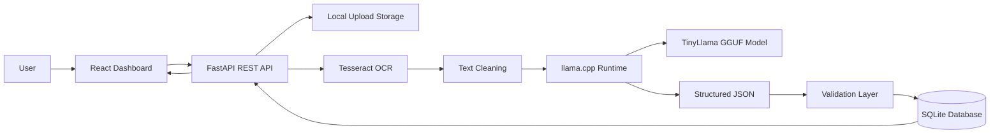
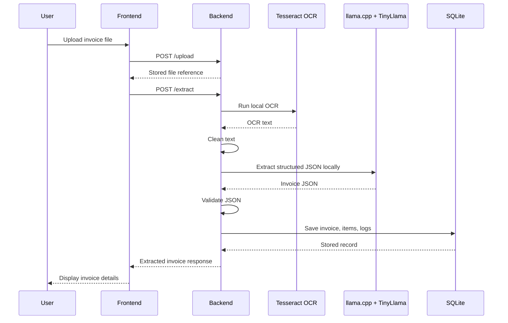
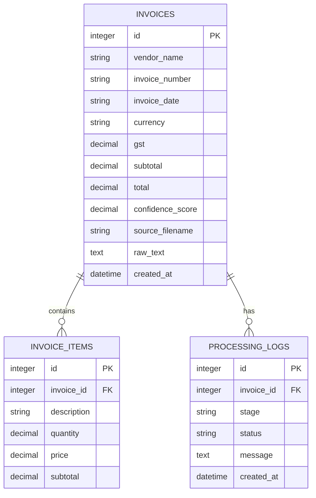
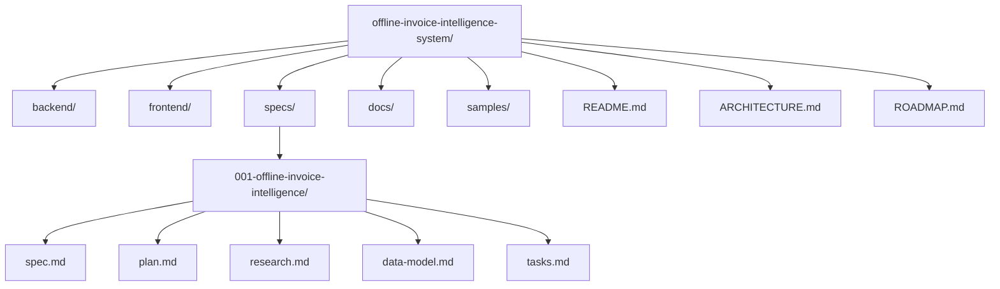

# Architecture

## Overview

Offline Invoice Intelligence System is a local web application for extracting structured invoice data from images and PDFs. It uses a React TypeScript frontend, a FastAPI backend, Tesseract OCR, TinyLlama GGUF through llama.cpp, and SQLite.

The system is designed to run fully offline after setup. All OCR, AI inference, validation, and persistence happen on the user's machine.

## System Architecture

## Component Responsibilities

| Component | Responsibility |
| --------- | -------------- |
| React Dashboard | Upload files, display extraction results, search invoice history |
| FastAPI Backend | Expose REST APIs and coordinate the extraction pipeline |
| Upload Storage | Keep source invoice files locally |
| Tesseract OCR | Extract text from invoice images and PDFs |
| Text Cleaning | Normalize OCR text before local AI processing |
| llama.cpp | Run the local TinyLlama GGUF model on CPU |
| TinyLlama GGUF | Convert cleaned OCR text into structured invoice JSON |
| Validation Layer | Ensure extracted fields match expected schema |
| SQLite | Store invoices, invoice items, and processing logs |

## Workflow

## Database ER Diagram

## Folder Structure

## Offline Boundary

The offline boundary includes:

- Uploaded invoice files
- OCR processing
- Cleaned invoice text
- Local LLM inference
- Structured JSON validation
- SQLite persistence
- Dashboard review

The system must not cross the offline boundary by sending invoice data to external services.

## Deployment Model

The application is deployed locally:

- Frontend runs on localhost.
- Backend runs on localhost.
- SQLite runs as an embedded local database.
- Tesseract, Poppler, llama.cpp, and TinyLlama GGUF are installed locally.

## Quality Attributes

- Privacy: invoice data remains local.
- Portability: can run on laptops without GPU.
- Maintainability: clear component boundaries.
- Auditability: records and logs are stored in SQLite.
- Reliability: structured output is validated before persistence.
- Demonstrability: Wi-Fi can be disabled during demo.
