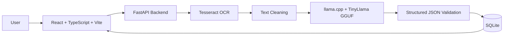
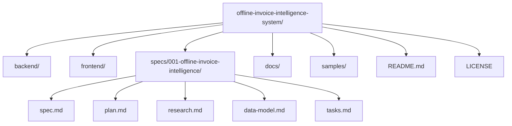

# Offline Invoice Intelligence System

Offline Invoice Intelligence System is an offline-first, CPU-only AI application that extracts structured invoice information from invoice images and PDFs. It is designed for environments where privacy, local execution, low hardware requirements, and independence from cloud services are essential.

The system uses Tesseract OCR for text extraction, TinyLlama GGUF through llama.cpp for local AI-assisted structuring, SQLite for local persistence, FastAPI for the backend API, and a React TypeScript Vite frontend for user interaction.

No OpenAI, Gemini, Anthropic, Claude, Groq, or external AI APIs are used. The application is intended to run completely offline after dependencies and local model files are installed.

## Project Description

Businesses receive invoices in many layouts and file formats, including scanned PDFs, camera images, and receipt images. Manual data entry into accounting software is slow, repetitive, and error-prone. This project automates invoice understanding locally by converting documents into structured JSON and storing extracted records in SQLite.

## Architecture



## Features

- Upload invoice images and invoice PDFs.
- Extract text locally using Tesseract OCR.
- Clean OCR output before AI extraction.
- Use TinyLlama GGUF through llama.cpp for local structured extraction.
- Store invoices, line items, and processing logs in SQLite.
- Search and review invoice history.
- Run on CPU-only laptops without CUDA or GPU inference.
- Work fully offline after setup.
- Preserve invoice data locally for privacy.
- Use AGPL-3.0 licensing for strong copyleft compliance.

## Installation

### Prerequisites

- Python 3.11 or later
- Node.js 20 or later
- Tesseract OCR installed locally
- Poppler installed locally for PDF image conversion
- llama.cpp built or downloaded locally
- TinyLlama GGUF model file downloaded locally before offline use

### Backend Setup

```bash
cd backend
python -m venv .venv
source .venv/bin/activate
pip install -r requirements-dev.txt
```

On Windows PowerShell:

```powershell
cd backend
python -m venv .venv
.venv\Scripts\Activate.ps1
pip install -r requirements-dev.txt
```

### Frontend Setup

```bash
cd frontend
npm install
```

## Offline Setup

Complete these steps while internet access is still available:

1. Install Python, Node.js, Tesseract OCR, and Poppler.
2. Install backend and frontend dependencies.
3. Build or download llama.cpp for the local machine.
4. Download the TinyLlama GGUF model file.
5. Configure local paths for the llama.cpp binary and GGUF model.
6. Disconnect Wi-Fi or disable network access.
7. Start the backend and frontend locally.
8. Upload an invoice image, receipt image, or invoice PDF.

The application must not require internet access during runtime.

## Running

Start the backend:

```bash
cd backend
uvicorn app.main:app --host 127.0.0.1 --port 8000
```

Start the frontend:

```bash
cd frontend
npm run dev
```

Open:

```text
http://127.0.0.1:5173
```

## Folder Structure



## API Documentation

| Method | Endpoint | Purpose |
| ------ | -------- | ------- |
| POST | `/upload` | Upload invoice image or PDF |
| POST | `/extract` | Run OCR and local AI extraction |
| GET | `/invoice/{id}` | Retrieve a stored invoice |
| GET | `/history` | List or search invoice history |
| DELETE | `/invoice/{id}` | Delete an invoice record |

Detailed API documentation is maintained in `docs/api.md`.

## Screenshots Placeholder

Add screenshots before final submission:

- Dashboard home screen
- Upload workflow
- Extracted invoice details
- Invoice history search
- Offline demo with Wi-Fi disabled

## Demo Instructions

1. Start backend and frontend locally.
2. Disable Wi-Fi.
3. Open the dashboard at `http://127.0.0.1:5173`.
4. Upload a sample invoice image or PDF.
5. Show OCR and local extraction output.
6. Show stored invoice history in SQLite.
7. Explain that all inference runs locally using Tesseract and llama.cpp.

## Future Scope

- Add multilingual OCR profiles.
- Add vendor-specific extraction templates.
- Add duplicate invoice detection.
- Add CSV and accounting software export.
- Add local embeddings for semantic search.
- Package as a desktop application.
- Improve confidence scoring with field-level validation.

## License

This project is licensed under the GNU Affero General Public License v3.0 or later.

SPDX-License-Identifier: AGPL-3.0-or-later

## Contributors

- Shravan
- Pratham
