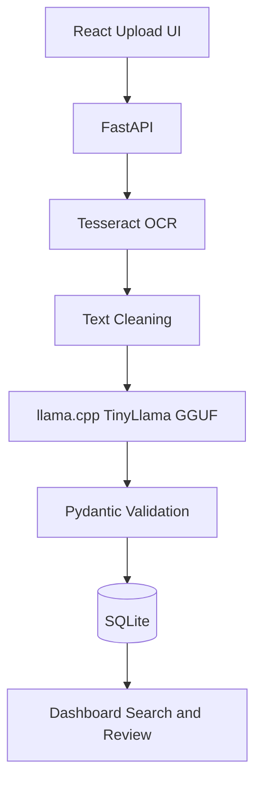
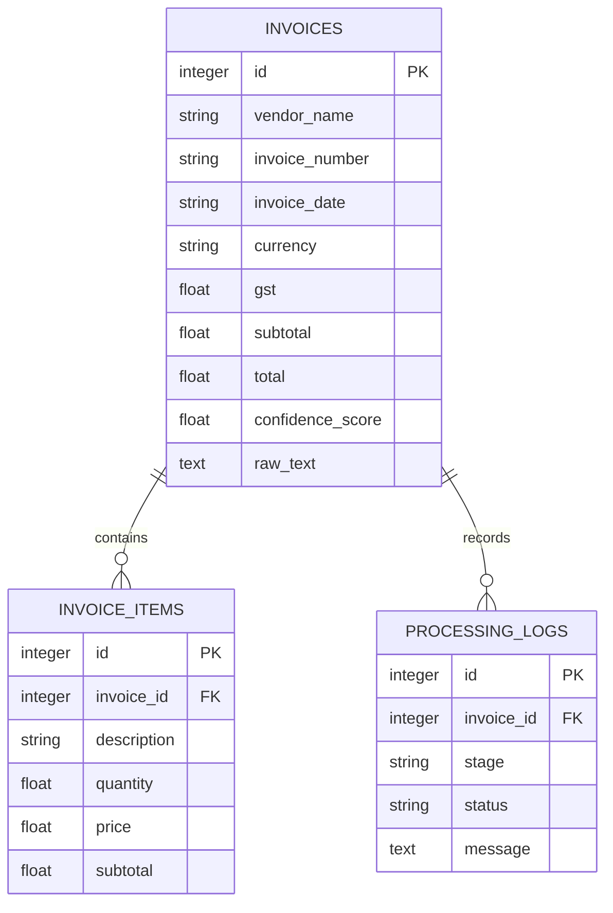

# Diagrams

## Architecture Diagram

```mermaid
flowchart TD
    Upload[React Upload UI] --> API[FastAPI]
    API --> OCR[Tesseract OCR]
    OCR --> Clean[Text Cleaning]
    Clean --> LLM[llama.cpp TinyLlama GGUF]
    LLM --> Validate[Pydantic Validation]
    Validate --> DB[(SQLite)]
    DB --> Dashboard[Dashboard Search and Review]
```

## ER Diagram

```mermaid
erDiagram
    INVOICES ||--o{ INVOICE_ITEMS : contains
    INVOICES ||--o{ PROCESSING_LOGS : records
    INVOICES {
        integer id PK
        string vendor_name
        string invoice_number
        string invoice_date
        string currency
        float gst
        float subtotal
        float total
        float confidence_score
        text raw_text
    }
    INVOICE_ITEMS {
        integer id PK
        integer invoice_id FK
        string description
        float quantity
        float price
        float subtotal
    }
    PROCESSING_LOGS {
        integer id PK
        integer invoice_id FK
        string stage
        string status
        text message
    }
```
