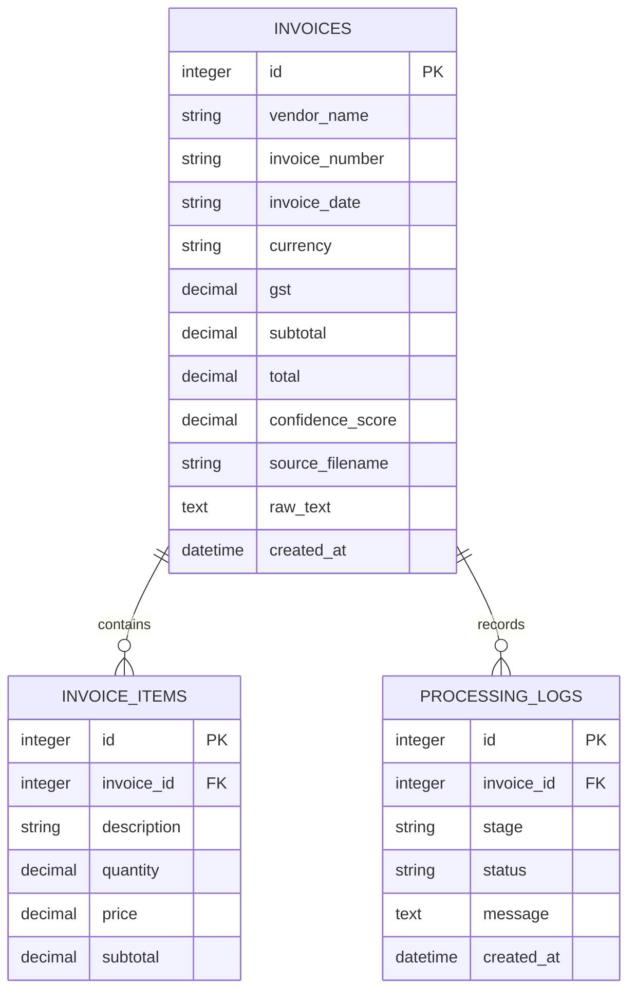

# Data Model: Offline Invoice Intelligence System

## Entity Relationship Diagram



## Invoice Table

| Column | Type | Description |
| ------ | ---- | ----------- |
| id | Integer | Primary key |
| vendor_name | String | Name of the invoice vendor |
| invoice_number | String | Vendor invoice identifier |
| invoice_date | String/Date | Invoice issue date |
| currency | String | Currency code such as INR or USD |
| gst | Decimal | GST or tax amount |
| subtotal | Decimal | Amount before tax |
| total | Decimal | Final invoice total |
| confidence_score | Decimal | Overall extraction confidence from 0 to 1 |
| source_filename | String | Uploaded file name or stored file reference |
| raw_text | Text | OCR text used for extraction |
| created_at | DateTime | Record creation timestamp |

## Invoice Item Table

| Column | Type | Description |
| ------ | ---- | ----------- |
| id | Integer | Primary key |
| invoice_id | Integer | Foreign key to invoices table |
| description | String | Item or service description |
| quantity | Decimal | Quantity purchased |
| price | Decimal | Unit price |
| subtotal | Decimal | Line item subtotal |

## Processing Logs Table

| Column | Type | Description |
| ------ | ---- | ----------- |
| id | Integer | Primary key |
| invoice_id | Integer | Optional foreign key to invoice |
| stage | String | Processing stage such as upload, OCR, extraction, validation |
| status | String | Status such as success, warning, failed |
| message | Text | Human-readable processing details |
| created_at | DateTime | Log creation timestamp |

## Relationships

- One invoice can have many invoice items.
- One invoice can have many processing logs.
- Invoice items cannot exist without an invoice.
- Processing logs may be linked to an invoice after invoice creation.

## JSON Schema

```json
{
  "$schema": "https://json-schema.org/draft/2020-12/schema",
  "title": "InvoiceExtraction",
  "type": "object",
  "required": [
    "vendor_name",
    "invoice_number",
    "invoice_date",
    "currency",
    "gst",
    "items",
    "subtotal",
    "total",
    "confidence_score"
  ],
  "properties": {
    "vendor_name": {
      "type": "string"
    },
    "invoice_number": {
      "type": "string"
    },
    "invoice_date": {
      "type": "string"
    },
    "currency": {
      "type": "string"
    },
    "gst": {
      "type": "number",
      "minimum": 0
    },
    "items": {
      "type": "array",
      "items": {
        "type": "object",
        "required": ["description", "quantity", "price", "subtotal"],
        "properties": {
          "description": {
            "type": "string"
          },
          "quantity": {
            "type": "number",
            "minimum": 0
          },
          "price": {
            "type": "number",
            "minimum": 0
          },
          "subtotal": {
            "type": "number",
            "minimum": 0
          }
        }
      }
    },
    "subtotal": {
      "type": "number",
      "minimum": 0
    },
    "total": {
      "type": "number",
      "minimum": 0
    },
    "confidence_score": {
      "type": "number",
      "minimum": 0,
      "maximum": 1
    }
  }
}
```

## Example JSON

```json
{
  "vendor_name": "ABC Electronics",
  "invoice_number": "INV-1024",
  "invoice_date": "2026-06-27",
  "currency": "INR",
  "gst": 540.0,
  "items": [
    {
      "description": "Keyboard",
      "quantity": 2,
      "price": 1200.0,
      "subtotal": 2400.0
    },
    {
      "description": "Mouse",
      "quantity": 1,
      "price": 600.0,
      "subtotal": 600.0
    }
  ],
  "subtotal": 3000.0,
  "total": 3540.0,
  "confidence_score": 0.86
}
```
