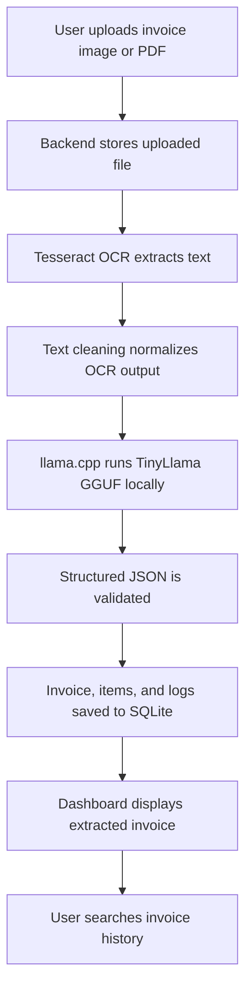

# Implementation Plan: Offline Invoice Intelligence System

## Architecture

The system follows a local web application architecture. The frontend provides document upload, extraction status, invoice review, and search. The backend exposes REST APIs, orchestrates OCR, calls the local AI extraction service, validates structured output, and stores records in SQLite.

All components run on the user's machine. AI inference and OCR are performed locally.

## ASCII Architecture Diagram

```text
+------------------+       +---------------------+
|                  |       |                     |
| React Dashboard  +------>+ FastAPI REST API    |
| TypeScript/Vite  |       | Local Backend       |
|                  |       |                     |
+------------------+       +----------+----------+
                                      |
                                      v
                           +----------+----------+
                           |                     |
                           | Tesseract OCR       |
                           | CPU Text Extraction |
                           |                     |
                           +----------+----------+
                                      |
                                      v
                           +----------+----------+
                           |                     |
                           | Text Cleaning       |
                           | Normalization       |
                           |                     |
                           +----------+----------+
                                      |
                                      v
                           +----------+----------+
                           |                     |
                           | llama.cpp           |
                           | TinyLlama GGUF      |
                           | CPU Local AI        |
                           |                     |
                           +----------+----------+
                                      |
                                      v
                           +----------+----------+
                           |                     |
                           | SQLite Database     |
                           | Invoices + Items    |
                           | Logs                |
                           |                     |
                           +---------------------+
```

## Workflow



## Technology Stack

| Layer | Technology | Reason |
| ----- | ---------- | ------ |
| Frontend | React | Component-based dashboard development |
| Frontend Language | TypeScript | Type safety and maintainability |
| Build Tool | Vite | Fast local development and build |
| Backend | FastAPI | High-performance Python API framework |
| OCR | Tesseract OCR | Mature open-source OCR engine |
| Local AI Runtime | llama.cpp | Efficient CPU inference for GGUF models |
| Local Model | TinyLlama GGUF | Lightweight local language model |
| Database | SQLite | Embedded local database with no server dependency |
| License | AGPL-3.0 | Strong copyleft open-source license |

## Development Plan

1. Define specification, architecture, data model, and team tasks.
2. Build the backend API surface for upload, extraction, invoice retrieval, history, and deletion.
3. Integrate Tesseract OCR and PDF/image handling.
4. Add text cleaning and local AI extraction through llama.cpp.
5. Validate extracted JSON and persist data in SQLite.
6. Build dashboard upload, review, and search workflows.
7. Add tests, quality checks, and CI.
8. Prepare offline demo and final documentation.

## Milestones

| Milestone | Description | Target |
| --------- | ----------- | ------ |
| M1 | Phase 1 documentation complete | Day 1 |
| M2 | Backend API skeleton complete | Day 1 |
| M3 | OCR pipeline integrated | Day 2 |
| M4 | Local LLM extraction integrated | Day 2 |
| M5 | SQLite persistence complete | Day 2 |
| M6 | Dashboard complete | Day 3 |
| M7 | Offline demo validated | Day 3 |
| M8 | Repository audit complete | Day 3 |

## Implementation Strategy

- Keep all inference local and CPU-only.
- Use simple REST APIs for frontend-backend communication.
- Store uploaded files and extracted records locally.
- Validate AI output before writing to SQLite.
- Maintain clear separation between OCR, AI extraction, persistence, and API layers.
- Prefer deterministic fallbacks where model output is uncertain.
- Keep setup and demo instructions explicit for hackathon review.

## Testing Strategy

| Test Type | Purpose |
| --------- | ------- |
| Unit Tests | Validate text cleaning, extraction parsing, schema validation |
| API Tests | Verify upload, extract, history, get, and delete endpoints |
| Integration Tests | Confirm OCR-to-JSON-to-SQLite flow |
| Frontend Tests | Verify dashboard rendering and user workflows |
| Manual Offline Tests | Confirm operation with Wi-Fi disabled |
| Security Checks | Scan for secrets and unsafe dependencies |
| Documentation Review | Confirm all required Phase 1 artifacts exist |

## Deployment Strategy

The application is deployed as a local web app:

- Backend runs on `127.0.0.1`.
- Frontend runs locally through Vite or a production static build.
- SQLite database is stored on the local machine.
- Tesseract, Poppler, llama.cpp, and TinyLlama GGUF are installed before offline execution.
- No public cloud deployment is required for the hackathon MVP.

## Risk Mitigation

| Risk | Mitigation |
| ---- | ---------- |
| OCR failure due to poor image quality | Recommend clean samples and add confidence scoring |
| Local model output malformed JSON | Validate output and provide fallback parser |
| Slow CPU inference | Use small model, compact prompts, and limited token output |
| Missing offline dependencies | Document setup checklist and demo preparation |
| Data privacy concerns | Keep all files and database records local |
